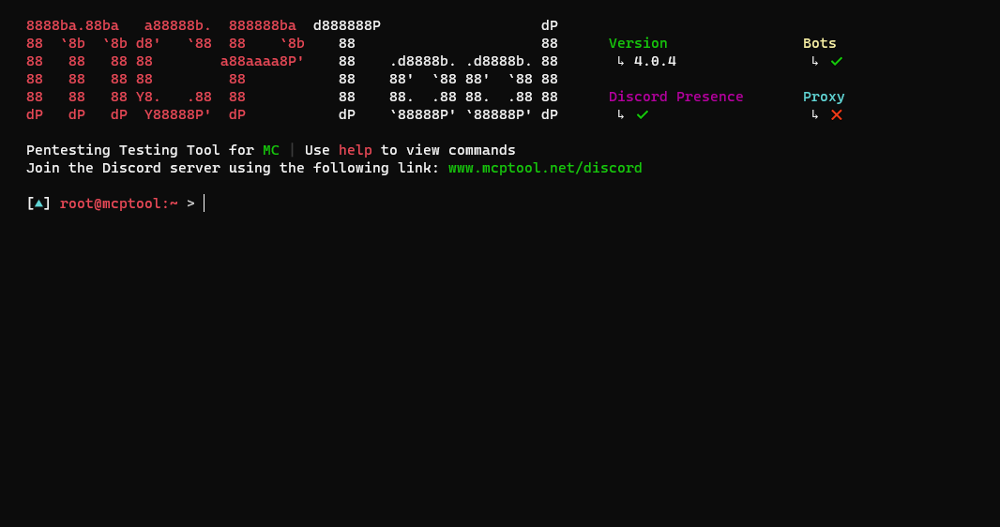
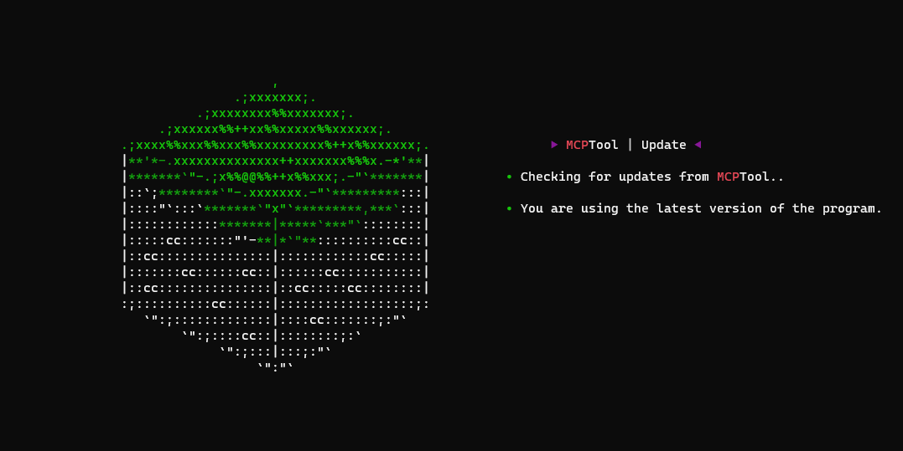
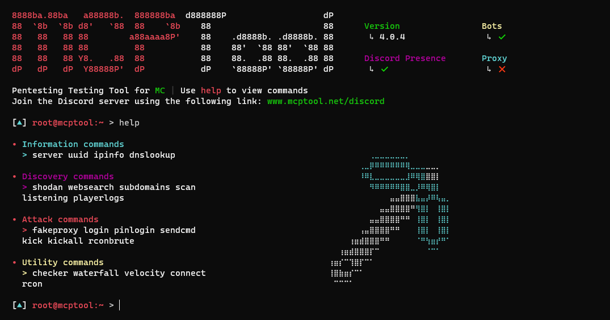

# 🧨  MCPTool v4.0.5

<h3> Ferramenta de Pentesting para Minecraft </h3>
 

### Este projeto foi criado para fins educacionais e não deve ser utilizado em ambientes sem autorização legal prévia.

# 🛠 Funcionalidades

* Exibir informações de um servidor.
* Visualizar informações de jogadores.
* Obter dados sobre um endereço IP (IP Info).
* Obter os domínios associados a um endereço IP.
* Obter registros DNS de um domínio.
* Buscar servidores aleatórios com base em dados de pesquisa (usando a API do Shodan).
* Encontrar servidores de Minecraft nas páginas de listagem mais populares.
* Escaneamento de portas (com Nmap e Qubo) e envio de um bot para verificar se é possível entrar no servidor.
* Obter informações de servidores de Minecraft a partir de uma lista em arquivo de texto.
* Capturar os nomes e UUIDs de todos os jogadores que entram no servidor (com data e hora de entrada e saída).
* Criar proxies locais do BungeeCord (Waterfall) e Velocity.
* Usar plugins encontrados nos servidores proxy.
* Criar um servidor proxy falso para capturar dados (Fake Proxy).
* Conectar-se a um servidor utilizando um bot cliente.
* Conectar-se ao RCON de um servidor e executar comandos.
* Iniciar ataque de força bruta para obter acesso ao console RCON.
* Iniciar ataque de força bruta para acessar contas de usuários (via comando `/login`).
* Expulsar jogadores tirando vantagem do erro "You logged in from a different location" (Kick/Kickall).
* Enviar um bot que executará uma lista de comandos programados ao entrar no servidor.
* Bots são totalmente compatíveis com Proxies.

## 💻 Sistemas operacionais suportados:

* ✅ Windows (8, 8.1, 10 e 11)
* ✅ Linux
* ✅ Termux (Android)

## ⛏️ Versões do Minecraft suportadas:

* 📃 1.8.x - 1.20.x

## Idiomas disponíveis

- **EN** (Inglês)
- **ES** (Espanhol)
- **FR** (Francês)
- **SK** (Eslovaco)
- **TR** (Turco)
- **DE** (Alemão)
- **CAT** (Catalão)
- **PT** (Português - Padrão)

## 🔧 Instalação 

Siga as etapas no [guia de instalação](./docs/es/instalation.MD).

## Comandos

Consulte o guia de comandos neste [link.](./docs/es/commands.MD).

## 🕹 Como usar

**python main.py**

## 📸 Capturas de Tela

## 🎞 Vídeo Demonstrativo 

## Licença 

Licença MIT

Copyright (c) 2023 Pedro Vega

A permissão é concedida, gratuitamente, a qualquer pessoa que obtenha uma cópia
deste software e arquivos de documentação associados (o "Software"), para lidar
no Software sem restrições, incluindo, sem limitação, os direitos
de usar, copiar, modificar, mesclar, publicar, distribuir, sublicenciar e/ou vender
cópias do Software, e permitir que as pessoas a quem o Software é
fornecido o façam, sujeito às seguintes condições:

O aviso de copyright acima e este aviso de permissão devem ser incluídos em todas
as cópias ou partes substanciais do Software.

O SOFTWARE É FORNECIDO "COMO ESTÁ", SEM GARANTIA DE QUALQUER TIPO, EXPRESSA OU
IMPLÍCITA, INCLUINDO MAS NÃO SE LIMITANDO ÀS GARANTIAS DE COMERCIALIZAÇÃO,
ADEQUAÇÃO A UM DETERMINADO FIM E NÃO INFRAÇÃO. EM NENHUM CASO OS
AUTORES OU DETENTORES DE DIREITOS AUTORAIS SERÃO RESPONSÁVEIS POR QUALQUER REIVINDICAÇÃO,
DANOS OU OUTRA RESPONSABILIDADE, SEJA EM UMA AÇÃO DE CONTRATO, ATO ILÍCITO OU DE OUTRA FORMA,
DECORRENTE DE, FORA DE OU EM CONEXÃO COM O SOFTWARE OU O USO OU OUTRAS NEGOCIAÇÕES NO
SOFTWARE.
